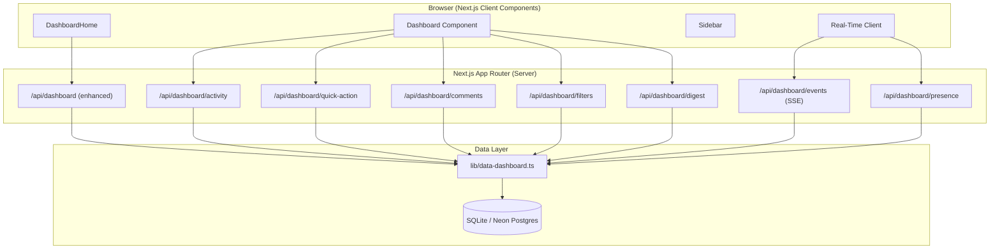
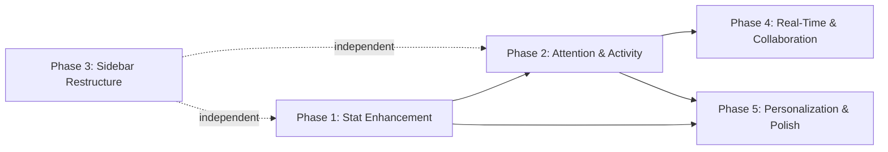
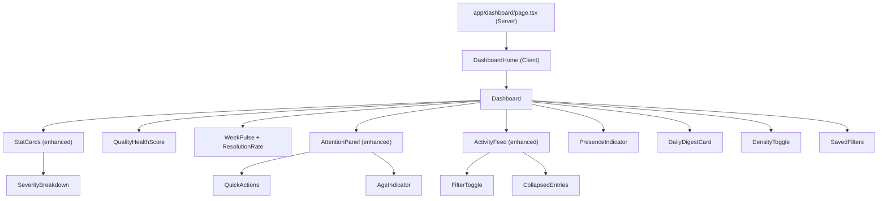

# Design Document: Dashboard UX Overhaul

## Overview

This design transforms the QA Daily Hub dashboard from a passive data display into an actionable, real-time collaboration hub. The overhaul is delivered across five independently deployable phases, each adding incremental value without breaking existing functionality.

The architecture follows a layered approach:
- **Data Layer**: Additive-only schema changes + new SQL queries in `lib/data-dashboard.ts`
- **API Layer**: Enhanced existing `/api/dashboard` endpoint + new focused endpoints per phase
- **Component Layer**: Extended existing components (`dashboard.tsx`, `sidebar.tsx`) + new isolated phase components
- **Real-Time Layer** (Phase 4): Server-Sent Events for presence and push notifications

Key design principles:
1. **Phase isolation** - each phase's code lives in clearly separated modules; no forward references
2. **Additive-only DB changes** - new columns/tables only; never alter or remove existing schema
3. **Graceful degradation** - missing data or failed features fall back silently to current behavior
4. **SQLite/Postgres compatibility** - all queries use double-quoted camelCase columns and branch via `isPostgres`

## Architecture

### System Architecture Diagram



### Phase Dependency Graph



### Component Hierarchy



## Components and Interfaces

### Phase 1 Components

#### `SeverityBreakdown` (within StatCard)
- Renders below the bug count in the existing "Open Bugs" StatCard
- Displays 4 severity levels: Critical, High, Medium, Low
- Each sub-count is a clickable link to `/bugs?severity={level}`
- Falls back to total-only display if `bugSeverityCounts` is missing from API

#### `ResolutionRateMetric` (within WeekPulse section)
- Displays `(resolved / created) × 100` as integer percentage
- Shows "N/A" when created count is zero
- Color-coded: amber below 70%, emerald at/above 70%
- Shows delta vs previous week as percentage-point change

#### `QualityHealthScore`
- Circular progress indicator showing composite score 0–100
- Formula: `0.4 × resolutionRate + 0.3 × inverseCriticalRatio + 0.3 × testPassRate`
- Color bands: red (<50), amber (50–74), emerald (≥75)
- Tooltip shows which metrics are incomplete when data is missing

### Phase 2 Components

#### `QuickActionButtons`
- Revealed on hover/focus within AttentionPanel items (100ms transition)
- "Assign" button → searchable dropdown of workspace members (max 50)
- "Change Status" button → dropdown of module-specific statuses
- Only visible to admin/superadmin roles
- Calls `PATCH /api/dashboard/quick-action` on selection

#### `AgeIndicator`
- Badge showing days since last status change: "Today", "3d", "10d"
- Color coding: slate (1–7d), amber (8–14d), red (>14d)
- Displays "-" when no status-change timestamp exists

#### `ActivityFeedFilter`
- Toggle with "My Activity" / "Team Activity" options
- Defaults to "Team Activity"
- Fetches from `GET /api/dashboard/activity?scope={my|team}`
- Preserves scroll position on toggle switch

#### `CollapsedActivityEntry`
- Groups 3+ entries with same action, entityType, actor within 5-minute window
- Shows "[count] [entityType] [action] by [actor]"
- Click to expand/collapse inline
- Max 50 entries shown when expanded

### Phase 3 Components

#### Sidebar restructure (in-place modification of `components/sidebar.tsx`)
- New group order: Dashboard, Test Management, Work Tracking, Documentation, Reports, System Settings
- "Work Tracking" group: Tasks, Bugs, Sprints
- "Documentation" group: Meeting Notes only
- "Reports" group: Report, Workload Heatmap, Deployment Log, Gantt / Timeline
- All existing ROLE_MENU hrefs preserved - only group assignments change

### Phase 4 Components

#### `PresenceIndicator`
- Shows up to 10 avatar circles with initials + "+N" overflow
- Online count displayed alongside
- Company-scoped
- Heartbeat via SSE; 5-minute inactivity timeout
- Fallback message when service unavailable

#### `NotificationToast` (push-based)
- SSE connection established on auth
- Toast on: assignment to user, critical bug in user's project
- Reconnection with exponential backoff (1s→30s max, 10 attempts)
- Connection status indicator: connected/reconnecting/disconnected
- Collapses to summary when >20 unread

#### `CommentThread` (in DashboardDrawer)
- Displayed below item details in existing `DashboardDrawer`
- Chronological comments with author, relative timestamp, content
- Input with 1–2000 char validation
- Read-only mode for users without write access
- Draft preserved on submission failure

### Phase 5 Components

#### `DailyDigestCard`
- Shown at top of dashboard before 12:00 local time
- Sections: new bugs, assigned items, status changes, upcoming deadlines (max 10 each)
- Dismissible per day (stored in localStorage)
- Not shown if zero relevant changes
- Error state with retry action; non-blocking

#### `DensityToggle`
- Header control: "Compact" / "Comfortable"
- Compact: 8px padding, 12px font, 8px gap
- Comfortable: 16px padding, 14px font, 16px gap (default)
- Persisted in localStorage
- Applied via CSS custom properties on dashboard container

#### `SavedFilters`
- "Save Filter" action when project filter is active
- Chips below filter control (own first, then shared, max 10 visible)
- Share toggle makes filter visible to company
- Stored in DB (`DashboardFilter` table)
- Max 20 per user; unique names per user+company

#### Micro-Animations
- StatCard value change: scale 1→1.05→1 + opacity 0.7→1, 300ms ease-out
- Attention item entry: slide-in-from-top, 200ms ease-out
- Activity entry: fade-in opacity 0→1, 200ms ease-out
- Respects `prefers-reduced-motion: reduce` (instant, no transitions)
- Uses transform + opacity only (no layout shifts)

## Data Models

### New Database Tables

#### `DashboardComment` (Phase 4)

```sql
CREATE TABLE IF NOT EXISTS "DashboardComment" (
  "id" SERIAL_OR_PK,
  "company" TEXT NOT NULL DEFAULT '',
  "entityType" TEXT NOT NULL,       -- 'Bug' | 'Task'
  "entityId" INTEGER NOT NULL,
  "authorId" INTEGER NOT NULL,
  "authorName" TEXT NOT NULL DEFAULT '',
  "content" TEXT NOT NULL,
  "deletedAt" DATE_TYPE,
  "createdAt" DATE_TYPE NOT NULL DEFAULT CURRENT_TIMESTAMP,
  "updatedAt" DATE_TYPE NOT NULL DEFAULT CURRENT_TIMESTAMP
);
```

Indexes:
```sql
CREATE INDEX IF NOT EXISTS "idx_dashcomment_company_entity" ON "DashboardComment"("company", "entityType", "entityId");
CREATE INDEX IF NOT EXISTS "idx_dashcomment_company_created" ON "DashboardComment"("company", "createdAt");
```

#### `DashboardFilter` (Phase 5)

```sql
CREATE TABLE IF NOT EXISTS "DashboardFilter" (
  "id" SERIAL_OR_PK,
  "company" TEXT NOT NULL DEFAULT '',
  "userId" INTEGER NOT NULL,
  "userName" TEXT NOT NULL DEFAULT '',
  "name" TEXT NOT NULL,
  "project" TEXT NOT NULL DEFAULT '',
  "activityScope" TEXT NOT NULL DEFAULT 'team',
  "density" TEXT NOT NULL DEFAULT 'comfortable',
  "shared" INTEGER NOT NULL DEFAULT 0,
  "deletedAt" DATE_TYPE,
  "createdAt" DATE_TYPE NOT NULL DEFAULT CURRENT_TIMESTAMP,
  "updatedAt" DATE_TYPE NOT NULL DEFAULT CURRENT_TIMESTAMP
);
```

Indexes:
```sql
CREATE INDEX IF NOT EXISTS "idx_dashfilter_company_user" ON "DashboardFilter"("company", "userId");
CREATE INDEX IF NOT EXISTS "idx_dashfilter_company_shared" ON "DashboardFilter"("company", "shared");
CREATE UNIQUE INDEX IF NOT EXISTS "idx_dashfilter_unique_name" ON "DashboardFilter"("company", "userId", "name") WHERE "deletedAt" IS NULL;
```

#### `PresenceHeartbeat` (Phase 4 - in-memory or lightweight table)

```sql
CREATE TABLE IF NOT EXISTS "PresenceHeartbeat" (
  "id" SERIAL_OR_PK,
  "company" TEXT NOT NULL DEFAULT '',
  "userId" INTEGER NOT NULL,
  "userName" TEXT NOT NULL DEFAULT '',
  "lastSeen" DATE_TYPE NOT NULL DEFAULT CURRENT_TIMESTAMP
);
```

Indexes:
```sql
CREATE UNIQUE INDEX IF NOT EXISTS "idx_presence_user" ON "PresenceHeartbeat"("userId");
CREATE INDEX IF NOT EXISTS "idx_presence_company_lastseen" ON "PresenceHeartbeat"("company", "lastSeen");
```

### Enhanced API Response (Phase 1 additions to `/api/dashboard`)

```typescript
// Added to existing dashboard response
interface DashboardResponsePhase1 {
  // ... existing fields ...
  bugSeverityCounts: {
    critical: number;
    high: number;
    medium: number;
    low: number;
  };
  resolutionRate: {
    current: number;        // percentage (0-100) or null if N/A
    previousWeek: number | null;
    delta: number | null;   // percentage-point change
  };
  qualityHealthScore: {
    score: number;          // 0-100 integer
    components: {
      resolutionRate: number | null;
      inverseCriticalRatio: number | null;
      testPassRate: number | null;
    };
  };
}
```

### Enhanced Attention Items (Phase 2 additions)

```typescript
interface AttentionItem {
  // ... existing fields ...
  statusChangedAt: string | null;  // ISO timestamp of last status change
  ageDays: number | null;          // computed days since statusChangedAt
  moduleType: 'Bug' | 'Task';     // for quick-action status options
}
```

### Activity Feed Response (Phase 2)

```typescript
interface ActivityFeedResponse {
  entries: ActivityEntry[];
  collapsed: CollapsedGroup[];
}

interface CollapsedGroup {
  count: number;
  action: string;
  entityType: string;
  actor: string;
  entries: ActivityEntry[];  // individual entries within group
  startTime: string;
  endTime: string;
}
```

## API Design

### Modified Endpoints

#### `GET /api/dashboard` (enhanced)

Added query parameters: none (backward compatible)

Added response fields (Phase 1):
- `bugSeverityCounts` - severity breakdown counts
- `resolutionRate` - current rate, previous week, delta
- `qualityHealthScore` - composite score with component breakdown

Added response fields (Phase 2):
- `attentionItems[].statusChangedAt` - ISO timestamp
- `attentionItems[].ageDays` - computed age in days

### New Endpoints

#### `GET /api/dashboard/activity` (Phase 2)

Query params:
- `scope`: `"my"` | `"team"` (default: `"team"`)
- `limit`: number (default: 50, max: 50)

Response:
```json
{
  "entries": [...],
  "collapsed": [
    { "count": 5, "action": "Created", "entityType": "Bug", "actor": "John", "entries": [...] }
  ]
}
```

Auth: requires authenticated user. Scoped by company.

#### `PATCH /api/dashboard/quick-action` (Phase 2)

Request body:
```json
{
  "entityType": "Bug" | "Task",
  "entityId": 123,
  "action": "assign" | "status",
  "value": "john@example.com" | "in-progress"
}
```

Response: `{ success: true }` or `{ error: "..." }`

Auth: requires admin or superadmin role. Returns 403 otherwise.

#### `GET /api/dashboard/comments?entityType=Bug&entityId=123` (Phase 4)

Response:
```json
{
  "comments": [
    { "id": 1, "authorName": "John", "content": "...", "createdAt": "..." }
  ]
}
```

#### `POST /api/dashboard/comments` (Phase 4)

Request body:
```json
{
  "entityType": "Bug" | "Task",
  "entityId": 123,
  "content": "Comment text (1-2000 chars)"
}
```

Validation: content trimmed, 1–2000 chars. Returns 400 on violation.

#### `GET /api/dashboard/events` (Phase 4 - SSE)

Server-Sent Events stream. Events:
- `presence` - online members update
- `notification` - assignment/critical bug alert
- `data-update` - dashboard section refresh signal

Connection: persistent, authenticated. Heartbeat every 30s.
Reconnection: client-side exponential backoff.

#### `POST /api/dashboard/presence` (Phase 4)

Request body: `{ "action": "heartbeat" | "disconnect" }`

Called every 60s by client. Entries older than 5 minutes are pruned.

#### `GET /api/dashboard/digest` (Phase 5)

Response:
```json
{
  "newBugs": [...],
  "assignedItems": [...],
  "statusChanges": [...],
  "upcomingDeadlines": [...],
  "hasData": true
}
```

Returns changes since user's last session. Max 10 items per section.

#### `GET /api/dashboard/filters` (Phase 5)

Response:
```json
{
  "own": [{ "id": 1, "name": "Sprint 5 Bugs", "project": "...", "shared": false }],
  "shared": [{ "id": 2, "name": "Critical View", "project": "...", "userName": "Alice" }]
}
```

#### `POST /api/dashboard/filters` (Phase 5)

Request body:
```json
{
  "name": "My Filter",
  "project": "ProjectX",
  "activityScope": "my",
  "density": "compact",
  "shared": false
}
```

Validation: name 1–50 chars, unique per user+company, max 20 per user.

#### `DELETE /api/dashboard/filters/[id]` (Phase 5)

Soft-deletes the filter. Only owner can delete.

### Phase Isolation Strategy

Each phase's API endpoints are self-contained:
- Phase 1: Only modifies the existing `/api/dashboard/route.ts` response (additive fields)
- Phase 2: New files `app/api/dashboard/activity/route.ts`, `app/api/dashboard/quick-action/route.ts`
- Phase 3: Only modifies `components/sidebar.tsx` (no API changes)
- Phase 4: New files `app/api/dashboard/events/route.ts`, `app/api/dashboard/presence/route.ts`, `app/api/dashboard/comments/route.ts`
- Phase 5: New files `app/api/dashboard/digest/route.ts`, `app/api/dashboard/filters/route.ts`

No phase imports code from a later phase. Shared utilities (auth, db, data-helpers) are pre-existing.

## Error Handling

### Graceful Degradation Strategy

| Feature | Failure Mode | Fallback Behavior |
|---------|-------------|-------------------|
| Severity breakdown | API field missing | Show total bug count only |
| Resolution rate | Zero created items | Display "N/A" |
| Quality health score | Metric unavailable | Use 0 for that component; show tooltip |
| Quick actions | Network error | Error toast; retain original state |
| Age indicator | No timestamp | Display "-" in slate |
| Activity filter | Fetch fails | Show loading state; retry button |
| Presence | SSE disconnects | Show "unavailable" message |
| Push notifications | Connection drops | Exponential backoff reconnection |
| Comments | Submit fails | Retain draft; show error |
| Daily digest | Timeout (5s) | Error state with retry; non-blocking |
| Density toggle | localStorage unavailable | Default to "Comfortable" |
| Saved filters | Referenced project deleted | Disabled chip with tooltip |

### Error Response Format

All new API endpoints return consistent error responses:

```typescript
// Success
{ success: true, data: { ... } }

// Client error (400/403/404)
{ error: "Human-readable message", code: "VALIDATION_ERROR" | "FORBIDDEN" | "NOT_FOUND" }

// Server error (500)
{ error: "An unexpected error occurred", code: "INTERNAL_ERROR" }
```

### Real-Time Connection Management

```typescript
// Client-side reconnection logic
const BACKOFF_BASE = 1000;
const BACKOFF_MAX = 30000;
const MAX_ATTEMPTS = 10;

function getBackoffDelay(attempt: number): number {
  return Math.min(BACKOFF_BASE * Math.pow(2, attempt), BACKOFF_MAX);
}
```

Connection states: `connected` → `reconnecting` → `disconnected` (after 10 failed attempts)

On reconnection success: fetch missed notifications (up to 50) via query param `since={lastEventTimestamp}`.

## Testing Strategy

### Testing Approach

This feature involves a mix of pure computation logic (score calculations, activity grouping, age computation) and UI/integration concerns (SSE connections, component rendering, API endpoints).

**Property-based testing** (using `fast-check` already in devDependencies) is appropriate for:
- Quality health score computation (pure function with numeric inputs)
- Resolution rate calculation (pure arithmetic with edge cases)
- Activity entry collapsing logic (grouping algorithm)
- Age indicator computation (date arithmetic)
- Severity count summation invariant

**Example-based unit tests** (Vitest) are appropriate for:
- API endpoint responses (mock DB, verify shape)
- Quick action permission checks
- Comment validation (length, whitespace)
- Saved filter uniqueness constraints
- Sidebar group restructure (static config)

**Integration tests** are appropriate for:
- SSE connection lifecycle
- Database schema compatibility (SQLite + Postgres)
- End-to-end dashboard load with new fields

## Correctness Properties

*A property is a characteristic or behavior that should hold true across all valid executions of a system - essentially, a formal statement about what the system should do. Properties serve as the bridge between human-readable specifications and machine-verifiable correctness guarantees.*

### Property 1: Severity count summation invariant

*For any* set of open bugs with severity values drawn from {critical, high, medium, low}, the sum of `bugSeverityCounts.critical + bugSeverityCounts.high + bugSeverityCounts.medium + bugSeverityCounts.low` SHALL equal the total open bug count, and each individual count SHALL equal the number of bugs with that specific severity in the input set.

**Validates: Requirements 1.1, 1.6**

### Property 2: Resolution rate computation and color assignment

*For any* pair of non-negative integers (resolved, created) where created > 0, the resolution rate SHALL equal `Math.round((resolved / created) * 100)` clamped to [0, ∞), and the assigned color SHALL be amber when the rate is below 70 and emerald when the rate is at or above 70. When created equals 0, the rate SHALL be null (displayed as "N/A").

**Validates: Requirements 2.1, 2.2, 2.3, 2.4**

### Property 3: Quality health score computation

*For any* three input values (resolutionRate, inverseCriticalRatio, testPassRate) each either null or a number, the quality health score SHALL equal `Math.floor(0.4 * clamp(r, 0, 100) + 0.3 * clamp(i, 0, 100) + 0.3 * clamp(t, 0, 100))` where null inputs are treated as 0, and the result SHALL always be an integer in the range [0, 100].

**Validates: Requirements 3.1, 3.2, 3.6, 3.7**

### Property 4: Quality health score color bands

*For any* quality health score integer in [0, 100], the assigned color SHALL be red when score < 50, amber when 50 ≤ score ≤ 74, and emerald when score ≥ 75. These three bands SHALL be exhaustive and mutually exclusive for all integers in [0, 100].

**Validates: Requirements 3.3, 3.4, 3.5**

### Property 5: Quick action role-based visibility

*For any* user role drawn from {superadmin, admin, fe, be, fullstack, qa, pm, ai}, the Quick_Action buttons SHALL be visible if and only if the role is "admin" or "superadmin". For all other roles, the buttons SHALL be hidden.

**Validates: Requirements 4.6, 17.3**

### Property 6: Age indicator computation and color bands

*For any* pair of dates (now, statusChangedAt) where statusChangedAt ≤ now, the age in days SHALL equal the floor of the calendar day difference. The display SHALL be "Today" when age < 1, the numeric day count followed by "d" otherwise. The color SHALL be slate for age 1–7, amber for age 8–14, and red for age > 14. When statusChangedAt is null, the display SHALL be "-" in slate.

**Validates: Requirements 5.1, 5.2, 5.3, 5.4, 5.5, 5.6**

### Property 7: Activity feed filtering by scope

*For any* set of activity entries with various creator identifiers and company values, filtering by "my" scope SHALL return only entries where the creator matches the current user, and filtering by "team" scope SHALL return only entries where the company matches the current user's company. Both filters SHALL preserve chronological ordering (descending by createdAt) and limit results to 50 entries.

**Validates: Requirements 6.2, 6.3**

### Property 8: Activity entry collapsing algorithm

*For any* ordered list of activity entries, the collapsing algorithm SHALL group entries that share the same (action, entityType, actor) and have createdAt timestamps within a 5-minute window into a single collapsed entry with count ≥ 3. No collapsed group SHALL contain entries with different action values. The collapsed entry format SHALL include the count, action, entityType, and actor. Entries that do not meet the 3-entry threshold SHALL remain uncollapsed.

**Validates: Requirements 7.1, 7.2, 7.5**

### Property 9: Sidebar role visibility preservation

*For any* role in {admin, fullstack, ai, qa, fe, be, pm}, the set of route hrefs visible to that role after the sidebar restructure SHALL be identical to the set of route hrefs visible before the restructure. The restructure SHALL only change group assignments and ordering, never the visibility of individual routes.

**Validates: Requirements 8.5, 17.1**

### Property 10: Comment content validation

*For any* string input, comment submission SHALL be accepted if and only if the trimmed string has length between 1 and 2000 characters (inclusive). Strings that are empty, contain only whitespace, or exceed 2000 characters after trimming SHALL be rejected.

**Validates: Requirements 11.2, 11.6**

### Property 11: Comment chronological ordering

*For any* set of comments with distinct createdAt timestamps, the Comment_Thread SHALL display them sorted by createdAt in ascending order (oldest first). The ordering SHALL be stable for comments with identical timestamps.

**Validates: Requirements 11.3**

### Property 12: Density preference persistence round-trip

*For any* density value in {"compact", "comfortable"}, saving the preference to localStorage and then reading it back SHALL return the same value. When localStorage is unavailable or contains an invalid value, the read SHALL return "comfortable" as the default.

**Validates: Requirements 13.4, 13.6**

### Property 13: Reconnection backoff delay calculation

*For any* attempt number N (0-indexed, 0 ≤ N < 10), the backoff delay SHALL equal `min(1000 * 2^N, 30000)` milliseconds. The sequence SHALL be monotonically non-decreasing and SHALL never exceed 30000ms.

**Validates: Requirements 10.4**

### PBT Configuration

- Library: `fast-check` (already installed)
- Minimum iterations: 100 per property
- Tag format: `Feature: dashboard-ux-overhaul, Property {N}: {description}`

